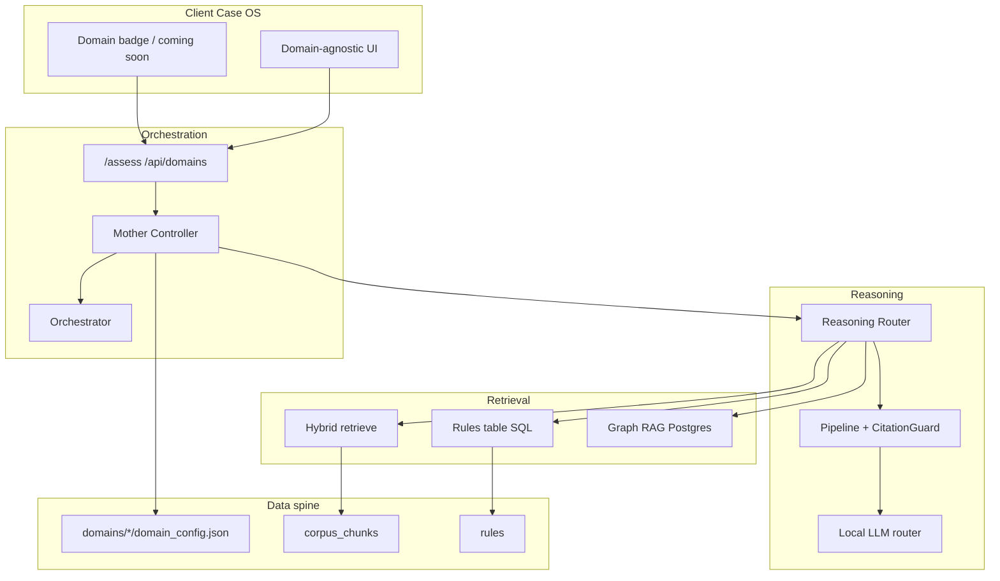

# Domain Plugin System v1

Generated: 2026-06-16  
Branch: `release/lawapp-clean-snapshot`  
Status: Implemented (employment production; four stub packs)

## Architectural intent

LawApp is a reusable legal engine with swappable domain plugins, not a single-purpose employment app.

The **Mother Algorithm** (route, retrieve, reason, govern) stays generic. Domain specificity lives only in:

- `domains/<code>/` packs (config, templates, prompts, ingestion pointers)
- PostgreSQL rules table rows (scoped by claim type / namespace)
- RAG corpus rows (scoped by `retrieval_domain` tag, e.g. `employment_uk`)

## Layer diagram



## Plug-in contract (law pack)

Each pack under `domains/<module_code>/` must provide `domain_config.json` validated by `domains/_schema/domain_pack.schema.json`.

| Field | Purpose |
|-------|---------|
| `module_code` | Stable id (`employment`, `immigration`, ...) |
| `jurisdiction` | Supported jurisdiction codes |
| `status` | `production` / `partial` / `stub` / `unavailable` |
| `enabled` | Whether assessments are allowed |
| `rules_namespace` | Rules-table logical partition |
| `retrieval_domain` | Corpus/RAG filter tag |
| `enabled_modules` | Matter types owned by this pack |
| `ingestion_sources` | Pointer file for ingestion manifests |
| `template_paths` | Document templates (pack-local) |
| `prompt_overrides_path` | Pack-local prompt files |
| `validation_rules_path` | Pack-local fact validation |

Runtime loader: `backend/domains/loader.py`  
Registry sync: `backend/domains/registry.py`  
Request resolution: `backend/domains/context.py` (`domain_code`, `X-Lawapp-Domain`, `LAWAPP_DOMAIN`)

## Hard design rules (must NOT contain domain logic)

| Layer | Must stay generic |
|-------|-------------------|
| `client/public` Case OS | No employment-only copy in shared shell; domain badge from API |
| `backend/core/brain.py` | Pipeline steps only; domain from registry/pack |
| `backend/core/orchestrator.py` | Agent routing via plugins + pack config |
| `backend/core/control_plane/mother_controller.py` | Passes `domain_code`; no legal rules |
| `backend/core/retrieve.py` | Scopes by `domain` parameter; no embedded statutes |

Allowed in core: `DOMAIN_DEFAULT` constant, `employment_law` classifier label, imports from `backend.domains.employment.*` for pack implementations (deadline calculators, templates).

## Roadmap

1. **Now:** `employment` pack (production, unfair dismissal MVP surface)
2. **Next:** Enable `immigration` by adding corpus + rules + tests, then flip `enabled: true` in pack JSON only
3. **Later:** `housing`, `benefits`, `debt` follow same pack drop-in pattern

No orchestration rewrite required to add a domain.

## API

- `GET /api/domains` list packs + `active_domain`
- `GET /api/domains/{code}` pack metadata
- `POST /assess` optional `domain_code` or header `X-Lawapp-Domain`

Stub domain assessment returns:

```json
{
  "status": "domain_unavailable",
  "domain_code": "immigration",
  "message": "... honest unavailable ..."
}
```

## Tests

- `tests/test_domain_pack_loader.py`
- `tests/test_domain_plugin_system.py`
- Existing `tests/test_domain_modularity.py`

## Migration

`db/migrations/086_domain_registry.sql` optional DB mirror for admin reporting. Filesystem packs remain authoritative at runtime.
