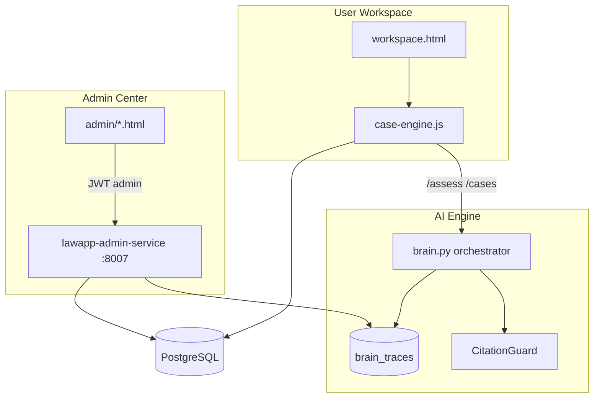

# Three-layer system

LawApp is structured as three cooperating layers. Each layer has a clear boundary, auth model, and audit trail.

## 1. User Workspace

The case operating environment for claimants and advisers preparing ET matters.

- **Surface:** static client `client/public/pages/workspace.html`
- **State:** `case-engine.js` (localStorage cache + API sync)
- **Scope:** one case per URL (`case_id`), hash tabs for timeline, evidence, notes, documents, analysis
- **Auth:** httpOnly JWT via `LAWAPP_AUTH.fetchWithAuth`
- **Not in scope:** admin visibility, cross-user case lists

## 2. AI Engine

Governed legal reasoning behind `/assess` and feature assessments.

- **Orchestrator:** `backend/core/brain.py` (rules, RAG, local Ollama, CitationGuard)
- **Policy:** no external LLM on legal routes; fail closed on weak grounding
- **Audit:** immutable `brain_traces` rows with sources, confidence, model version
- **Memory:** case-scoped `legal_memory` when consent and auth allow

## 3. Admin Center

Reviewer and operator visibility (owner decision: dedicated service on port 8007).

- **UI:** `client/public/admin/*` (protected by `is_admin`)
- **APIs:** real PostgreSQL queries, no mock dashboards
- **Compliance view:** CitationGuard weak-grounding flags from `brain_traces`
- **Future:** SSO + MFA for reviewer accounts (see `docs/decisions/OWNER_DECISIONS_2026-06-16.md`)

## Data flow summary

1. User opens workspace with a saved case.
2. Case bundle loads from case/matter APIs; timeline and evidence render in left tabs.
3. Analysis panel calls `/assess`; brain pipeline writes `brain_traces`.
4. Admin reviewers open `/admin/ai-logs.html` to inspect traces, sources, and compliance flags.

## Deployment notes

| Component | Default port |
|-----------|----------------|
| Monolith (UI + case APIs) | 8000 |
| lawapp-admin-service | 8007 |

Run migration `081_admin_audit_extensions.sql` before relying on extended audit columns or `users.is_admin`.
