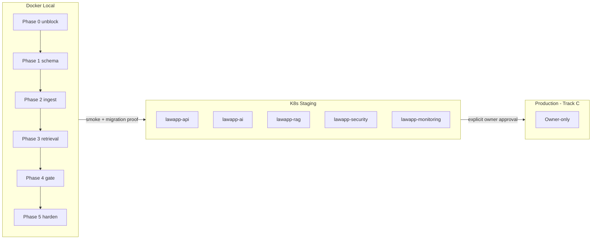

# UK Employment Law Knowledge Layer  -  Deployment Integration Plan

**Version:** 0.1 (planning only  -  no execution)  
**Date:** 16 June 2026  
**Source work order:** [`tasks/DEPLOYMENT_ORDER_uk_employment_law.md`](../../tasks/DEPLOYMENT_ORDER_uk_employment_law.md)  
**Branch context:** `release/lawapp-clean-snapshot` per [`tasks/PROJECT_STATUS.md`](../../tasks/PROJECT_STATUS.md)  
**Status:** Phase 0 in progress  -  owner decisions RESOLVED ([`OWNER_DECISIONS_2026-06-16.md`](../decisions/OWNER_DECISIONS_2026-06-16.md))

---

## 1. Summary of deployment order requirements

The UK Employment Law Deployment Work Order defines a **DB-first knowledge architecture** for deterministic, citable, defensible UK employment law answers. Core mandates:

| Principle | Requirement |
|-----------|-------------|
| **DB-first** | Curated corpus retrieval runs before any LLM generation |
| **LLM as gated feeder** | Model output lands in staging (`answer_candidate`); promotion to first-line store only after verification |
| **Temporal versioning** | Every provision carries `effective_from` / `effective_to`; retrieval must filter by reference date (ERA 2025 phased commencement) |

### Datastores (two tiers)

**Knowledge tier**

1. **Postgres corpus**  -  source-of-truth provisions (`legal_source`, `provision`, `module`, `curated_answer`, `embedding`)
2. **pgvector**  -  HNSW index on `embedding` table (spec: `vector(1024)`)
3. **Neo4j**  -  knowledge graph (statute ↔ case ↔ concept ↔ remedy); graph-RAG on port **8018**

**Operational tier** (existing)

4. Application Postgres  -  users, cases, sessions (host **5435** in local override)
5. Redis  -  cache, rate limits
6. Audit store  -  append-only via audit service **8020**

### Content taxonomy

- **16 modules** (14 employment + 2 cross-cutting: `DATA_PROTECTION`, `ATYPICAL_WORKERS`)
- Seed in `module` table with codes like `UNFAIR_DISMISSAL`, `DISCRIMINATION`, etc.

### Trusted source connectors (priority order)

1. legislation.gov.uk (7 target statutes + ERA 2025 prospective rows)
2. Find Case Law (one leading authority per module  -  **licence blocking**)
3. ACAS
4. gov.uk
5. EHRC / HSE

### Service topology (Docker compose ports)

| Service | Port | Role in order |
|---------|------|---------------|
| Main API | 8000 | Orchestration, static frontend |
| Rules | 8016 | Module routing, time-limit logic |
| RAG | 8017 | DB-first retrieval over corpus + vector |
| Graph-RAG | 8018 | Neo4j traversal (**Phase 0 blocker**) |
| Redaction | 8019 | PII strip before logging |
| Audit | 8020 | Append-only governance log |
| Admin | 8007 | Reviewer UI for governance gate |
| Case | 8008 | Case-backed flows |
| Notification | 8009 | Reviewer/user alerts |

### Phased sequence (7 weeks, gate on acceptance)

| Phase | Focus | Key acceptance |
|-------|--------|----------------|
| **0** | Unblock graph-RAG; corpus Postgres + pgvector; Neo4j; seed 16 modules | All compose services healthy including 8018 |
| **1** | Full corpus DDL; temporal query helper; ERA 2025 unit tests | Date-scoped queries exclude/include prospective rows correctly |
| **2** | Ingestion connectors (legislation → FCL → ACAS); checksum re-versioning | ERA 1996 section-level; ERA 2025 `prospective`; idempotent re-run |
| **3** | DB-first RAG + graph traversal; citation-bearing answers | Every claim has provision citation; date-scoped |
| **4** | LLM feeder + governance gate + admin reviewer UI | No direct writes to `provision`/`curated_answer` |
| **5** | Audit chain, redaction, verified/unverified badges | Full answer → audit reconstructability |

**Out of scope for this order:** payments, frontend redesign, Ollama model selection.

---

## 2. Current lawapp state vs order requirements (gap table)

| Area | Deployment order expects | Current lawapp state | Gap severity |
|------|--------------------------|----------------------|--------------|
| **Graph-RAG (8018)** | Healthy; Neo4j traversal | **Crash loop**  -  `backend.core.rag.graphrag_traversal` **missing** from repo; service imports it in `lawapp-graph-rag-service/main.py` | 🔴 P0 |
| **Graph store** | Neo4j with `Module`, `Provision`, `Judgment`, etc. | Postgres `legal_nodes` / `legal_edges` (migration 018); user-case `graph_nodes` / `graph_edges` (042); **no Neo4j in docker-compose** | 🔴 Architecture fork |
| **Module taxonomy** | 16-row `module` table (`UNFAIR_DISMISSAL`, …) | `employment_modules`  -  **24 keys**, different naming (`unfair_dismissal`, …); **11 production + 13 partial** in product | 🟡 Taxonomy mismatch |
| **Corpus schema** | `legal_source`, `provision`, `embedding`, `curated_answer`, `answer_candidate` | `legal_sources`, `corpus_chunks`, `legislation`, `acas_guidance`, `rules`; **no `provision` or governance tables** | 🔴 Schema fork |
| **Embeddings** | `embedding` table, `vector(1024)`, HNSW | `corpus_chunks.embedding` **`vector(384)`**, IVFFlat on legacy tables; compose bootstrap still references `text-embedding-3-small` / 1536 in env | 🟡 Dimension + model mismatch |
| **Temporal retrieval** | Mandatory `as_at_date` filter on `provision` | `corpus_chunks` has `effective_from`/`effective_to`/`is_prospective`; not unified with order's provision model | 🟡 Partial |
| **RAG service (8017)** | Corpus + vector with module + date filters | Queries **`corpus_chunks`** hybrid FTS + pgvector; no `module_id` or mandatory date filter per order | 🟡 Behaviour gap |
| **Governance gate** | `answer_candidate` → verify → `curated_answer` | CitationGuard + brain pipeline; **no staging/promotion tables**; admin service exists but no reviewer gate UI for candidates | 🔴 Missing |
| **Ingestion** | Per-authority adapters with checksum re-versioning | `ingestion.legislation`, `ingestion.acas`, `db-bootstrap` profile; **889 chunks** (881 embedded); binding pipeline via scraper → engineer → db-rag agents | 🟡 Overlap + gap |
| **Find Case Law** | Bulk/per-judgment; one authority per module | Gated: `FCL_BULK_LICENCE_GRANTED=false`; docs in `docs/FCL_*`  -  **no written grant** | 🔴 Licence blocker |
| **Licensing metadata** | Per `legal_source` licence field | `legal_sources.licence_name`, `bulk_ingestion_allowed`, `gate_env_var`  -  spine exists but **not go-live confirmed** | 🟡 Blocking at Phase 2 |
| **Docker local** | 12/12 healthy incl. 8018 + Neo4j | **12/12 healthy** except **8018 restarting**; no Neo4j container ([`LAWAPP_DOCKER_TEST_ENV.md`](../qa/LAWAPP_DOCKER_TEST_ENV.md)) | 🔴 Phase 0 |
| **K8s** | Namespaces: `lawapp-ai`, `lawapp-rag`, `lawapp-api`, `lawapp-monitoring`, `lawapp-security` | **`infra/k8s/`** has full set incl. monitoring CronJobs; **`k8s/`** has partial manifests (brain, rag, citation-guard); **no Neo4j manifest**; split between monolith backend (`lawapp-api`) and `services/` images | 🟡 Dual manifest trees |
| **Production readiness** | Licensing confirmed; full audit chain | **NO-GO** public prod; **GO WITH RISK** controlled beta; P0 blockers: k6 rate limit, corpus <1000, Ollama/live accuracy | 🔴 Track B/C gates |
| **Agentic foundation** | (Not in order) | Phase 1 orchestration/RAG rerank/feedback scaffold shipped ([`AGENTIC_FOUNDATION_PLAN.md`](../architecture/AGENTIC_FOUNDATION_PLAN.md))  -  must **not bypass** new gate | 🟡 Integration constraint |

---

## 3. Integration plan  -  phased deployment

### Guiding strategy

Integrate the deployment order **without forking** the running beta stack. Prefer **additive migrations** and explicit owner choice on schema/graph forks (see §6). Sequence: **local Docker proof → staging K8s → production (Track C owner only)**.



---

### Stage A  -  Docker local (Phases 0–5 from work order)

**Namespace analogue:** single compose project; all services share `db` + `redis` networks.

| Step | Action | Namespaces / services |
|------|--------|------------------------|
| A.0 | Fix graph-RAG import **or** interim stub that fails closed (owner choice); add **Neo4j** service to compose if Neo4j path chosen | `lawapp-graph-rag-service:8018`, new `neo4j` |
| A.1 | Enable pgvector (already on `pgvector/pgvector:pg16`); create corpus schema per owner decision (§6 Q1) | `db` |
| A.2 | Seed 16 `module` rows **or** map from `employment_modules` | `db` |
| A.3 | Run Phase 1 DDL + temporal helper + tests | `db`, `ingestion` profile |
| A.4 | Wire legislation.gov.uk connector (extend existing `ingestion.legislation` vs new adapter) | `ingestion`, `db-bootstrap` |
| A.5 | Extend RAG 8017 for date-scoped provision retrieval | `lawapp-rag-service` |
| A.6 | Graph traversal  -  Neo4j sync job **or** Postgres `legal_nodes` path | `8018` |
| A.7 | Governance gate tables + admin reviewer routes | `8007`, `8020` |
| A.8 | Brain/orchestrator: retrieval-first, gate on miss only | `backend:8000` |
| A.9 | Redaction before audit log; citation + verified badge in API response | `8019`, `8020` |

**Local verification** (from [`LAWAPP_DOCKER_TEST_ENV.md`](../qa/LAWAPP_DOCKER_TEST_ENV.md)):

```powershell
docker compose ps
Invoke-WebRequest http://localhost:8018/health -UseBasicParsing  # must pass after A.0
```

---

### Stage B  -  Staging K8s (Talos / existing cluster)

Apply manifests under **`infra/k8s/`** (authoritative for namespaces) and reconcile with **`k8s/`** service deployments.

| Namespace | Current workloads | UK law order additions |
|-----------|-------------------|------------------------|
| **lawapp-api** | `lawapp-backend`, `lawapp-postgres` STS | Corpus schema migrations on shared Postgres; config for `RAG_SERVICE_URL`, `GRAPH_RAG_SERVICE_URL` |
| **lawapp-ai** | `lawapp-brain`, `lawapp-llm-gateway`, `lawapp-rules-engine`, Ollama DS | Brain must call gated retrieval path; rules engine module routing aligned to 16-module catalog |
| **lawapp-rag** | `lawapp-rag-retrieval`, `lawapp-rag-ingestion`, `lawapp-crawler`, `lawapp-worker` | Ingestion jobs for legislation/ACAS; **new Neo4j StatefulSet** if chosen; embed worker dimension match |
| **lawapp-security** | `lawapp-citation-guard` | Enforce no promotion without `citation_ids`; block direct LLM → corpus writes |
| **lawapp-monitoring** | Freshness + health CronJobs | Extend freshness report for `provision` checksum drift; gate alerts on 8018/8017 readiness |

**Staging entry criteria:** Phase 3 acceptance on Docker; pytest + docker collect green; graph-RAG health 200.

**Staging smoke (from Track C handoff pattern):**

- `GET /health` on backend
- `POST /api/rag/hybrid-search` with `as_at_date`
- `GET /api/brain/trace/{id}` shows retrieval-before-LLM
- Auth-gated `/cases`

---

### Stage C  -  Production (owner only  -  Track C)

No agent execution. See [`reports/TRACK_C_OWNER_HANDOFF.md`](../../reports/TRACK_C_OWNER_HANDOFF.md).

- Build/push from **release branch** (not `main` until owner approves)
- Production secrets, Stripe live, backup drill
- Marketing sign-off for module scope (11 production topics vs 16-module knowledge layer)

---

## 4. Dependencies

### Database migrations

| Dependency | Notes |
|------------|-------|
| New migration(s) for order schema | `module`, `legal_source`, `provision`, `answer_candidate`, `curated_answer`, `embedding`  -  **or** views mapping to `corpus_chunks` if owner extends spine |
| pgvector extension | Already enabled on compose `db` |
| Neo4j persistence | New volume + backup policy if Neo4j adopted |
| Embedding dimension migration | **384 vs 1024**  -  requires re-embed job; downtime plan for HNSW rebuild |
| `employment_modules` ↔ `module` mapping | Data migration / sync view |
| Agentic foundation `076_agentic_foundation.sql` | Keep; do not bypass compliance fields on brain trace |

### Services

| Service | Dependency |
|---------|------------|
| `lawapp-graph-rag-service` | `graphrag_traversal.py` **or** refactor to existing `legal_nodes` SQL |
| `lawapp-rag-service` | Corpus table access, Redis, date filter API contract |
| `lawapp-admin-service` | Reviewer UI/API for `answer_candidate` workflow |
| `lawapp-audit-service` | Append-only events for gate transitions |
| `lawapp-redaction-service` | PII strip before query logging (Phase 5) |
| `backend` / Brain | Orchestration order: rules → RAG → graph → LLM-on-miss → CitationGuard |
| `outbox-worker` | Optional: async promotion jobs |

### Legal data pipeline (binding  -  do not skip stages)

Per [`PROJECT_STATUS.md`](../../tasks/PROJECT_STATUS.md):

```
uk-employment-law-scraper-agent
  → legal-data-engineer-agent
  → db-rag-ingestion-agent
  → ai-brain-citationguard-agent
  → qa-release-gatekeeper
```

Deployment order connectors **must** feed through this chain for production rows. No FCL bulk without licence. No fabricated citations.

### Environment variables (new or clarified)

| Variable | Purpose |
|----------|---------|
| `NEO4J_URI`, `NEO4J_USER`, `NEO4J_PASSWORD` | If Neo4j deployed |
| `CORPUS_SCHEMA` / `KNOWLEDGE_MODE` | Feature flag: `legacy` vs `provision` (if dual-run) |
| `EMBEDDING_DIM` | Must match DB column (384 or 1024) |
| `FCL_BULK_LICENCE_GRANTED` | Already exists  -  **must stay false** until written grant |
| `GRAPH_RAG_SERVICE_URL` | Already in backend compose |
| `AS_AT_DATE_DEFAULT` | Optional; prefer explicit per-request date |
| `ANSWER_CANDIDATE_AUTO_CHECK_THRESHOLD` | Gate automation |
| `LAWAPP_LOAD_TEST_MODE` | Unrelated but open P0  -  do not conflate with knowledge deploy |

---

## 5. Risks and blockers (checkpoint / gatekeeper)

| ID | Risk / blocker | Source | Mitigation in plan |
|----|----------------|--------|-------------------|
| **R1** | Graph-RAG crash blocks Phase 0 | Docker test env, work order §10 | Fix import or Postgres-graph fallback before any K8s promote |
| **R2** | Schema fork duplicates corpus | Gap analysis | Owner decision Q1 before migrations |
| **R3** | Neo4j net-new ops burden | No compose/K8s manifest today | Owner decision Q2; defer Phase 3 graph until stable |
| **R4** | FCL licence not granted | `FCL_BULK_LICENCE_GRANTED=false`, `docs/FCL_*` | Phase 2 case-law limited to sample/licensed rows only |
| **R5** | ACAS / EHRC licensing unverified | Work order §7, §12 | Record licence on each `legal_source` before go-live |
| **R6** | Hallucination → corpus contamination | Work order §12 | Enforce gate; CitationGuard; no bypass via agentic path |
| **R7** | Wrong-date answers | ERA 2025 commencement | Temporal filter in **retrieval layer**, not storage only |
| **R8** | k6 rate limit FAIL (P0-001) | PROJECT_STATUS | Knowledge deploy does not fix; do not claim prod scale |
| **R9** | Corpus 889 vs 1000 stretch (P0-004) | Track B | Parallel ingest OK; separate acceptance metric |
| **R10** | Dual K8s manifest trees (`k8s/` vs `infra/k8s/`) | Repo layout | Standardize on `infra/k8s/` for staging apply |
| **R11** | Public production NO-GO | Go-live matrix | This order targets **knowledge layer**; beta scope unchanged until gatekeeper ACCEPT |
| **R12** | Track C owner-only | TRACK_C handoff | No secret rotation, no prod deploy, no main push from agents |

---

## 6. Questions for owner  -  RESOLVED

All 15 questions answered 16 June 2026. Full verbatim record: [`docs/decisions/OWNER_DECISIONS_2026-06-16.md`](../decisions/OWNER_DECISIONS_2026-06-16.md).

| # | Topic | Decision summary |
|---|-------|----------------|
| Q1 | Schema | Greenfield `knowledge.*` canonical; `corpus_chunks` becomes embedding layer on `provision.id`; time-boxed dual-write then cutover |
| Q2 | Graph | Postgres `legal_nodes`/`legal_edges`; no Neo4j; 8018 fail-closed traversal |
| Q3 | Modules | 16 codes + mapping from 24 `employment_modules`; honest production/partial/unavailable |
| Q4 | FCL | Sample-only until Computational Analysis Licence; no bulk judgment embedding |
| Q5 | Embeddings | 1024-dim local (bge-large-en-v1.5 or mxbai-embed-large via Ollama); re-embed ~889 chunks |
| Q6 | Phase 0 timing | Parallel with Track A+B repairs; gate risky phases on re-ACCEPT |
| Q7 | DB isolation | Shared `lawapp` DB, `knowledge.*` schema namespace |
| Q8 | K8s | `infra/k8s/` canonical; deprecate `k8s/` |
| Q9 | Admin gate | `lawapp-admin-service` (8007), SSO+MFA reviewers |
| Q10 | ERA 2025 | Scheduled detection + human sign-off before `in_force` flip |
| Q11 | Licensing | Owner sign-off per source; record on each `legal_source` row |
| Q12 | Staging | Separate cluster (not prod namespace only) |
| Q13 | Beta API | Per-module status + real coverage count |
| Q14 | Ollama gate | In-cluster Deployment in AI namespace; dev uses local host |
| Q15 | Track C | Independent milestone; not prod-ready trigger |

---

## 7. Recommended execution order (numbered steps)

**Planning / owner gate (now)**

1. Owner answers §6 blocking questions Q1–Q5.
2. Publish ADR: schema + graph + module taxonomy decisions.
3. QA gatekeeper acknowledges plan  -  no implementation until ACCEPT on approach.

**Phase 0  -  Local unblock (week 1)**

4. Restore `graphrag_traversal` **or** refactor 8018 to Postgres graph with failing-closed health.
5. Add Neo4j to docker-compose **if** Q2 = Neo4j.
6. Migration: seed 16 modules (or mapping).
7. Verify: `docker compose ps` all healthy; `8018/health` 200.

**Phase 1  -  Schema (week 2)**

8. Apply corpus DDL per Q1 decision.
9. Implement `law_as_at(module_id, as_at_date)` helper + ERA 2025 tests.
10. Run `pytest` + docker collect.

**Phase 2  -  Ingestion (weeks 3–4)**

11. legislation.gov.uk connector for 7 statutes + ERA 2025 prospective rows.
12. ACAS connector (checksum re-version).
13. FCL sample ingest only unless Q4 granted.
14. Prove idempotent re-run (zero new versions on unchanged upstream).

**Phase 3  -  Retrieval (week 5)**

15. RAG 8017: module + date filters; citation in response payload.
16. Graph 8018: traversal joined to Postgres provision text.
17. Brain pipeline: retrieval-first; trace shows chunks/provisions used.

**Phase 4  -  Governance gate (week 6)**

18. `answer_candidate` workflow + auto-check threshold.
19. Admin reviewer promote/reject API.
20. Promotion job → `curated_answer` + embed + graph links.
21. Negative test: direct LLM write to `provision` must fail.

**Phase 5  -  Hardening (week 7)**

22. Audit every gate transition to 8020.
23. Redaction 8019 on logged queries.
24. API: citation + effective date + verified/unverified badge.
25. End-to-end audit reconstructability test.

**Staging K8s**

26. Apply `infra/k8s` config/secrets (owner-provided values).
27. Deploy updated images from release branch.
28. Run staging smoke suite (§3 Stage B).
29. Monitoring CronJobs: freshness on new corpus tables.

**Production (Track C  -  owner only)**

30. Owner: secrets rotation, image promote, Stripe, backup drill, marketing sign-off.
31. Gatekeeper final ACCEPT for public production.

---

## 8. What NOT to do

| Prohibition | Reason |
|-------------|--------|
| **No push to `main`** | Track C: release branch only until owner approves |
| **No Track C execution** | Secrets rotation, prod deploy, Stripe live, backup drill  -  owner handoff only |
| **No secret rotation or printing secrets** | G2 / security policy |
| **No `FCL_BULK_LICENCE_GRANTED=true`** without written grant | Legal + PROJECT_STATUS binding pipeline |
| **No fake legal rows or citations** | Gatekeeper reject; scraper → engineer → ingest chain mandatory |
| **No direct LLM writes to authoritative corpus** | Work order hard rule |
| **No weakening CitationGuard / brain bypass** | Agentic foundation + qa-release-gatekeeper |
| **No claiming public production GO** | k6 FAIL, corpus stretch, K8s/secrets open |
| **No Neo4j/graph-RAG "healthy" without real traversal** | Pod Running ≠ wired |
| **No conflating 16-module knowledge layer with 11-topic beta** | Product scope honesty |
| **No deployment execution in this planning task** | This document only |

---

## Appendix A  -  Reference file map

| Document / path | Relevance |
|-----------------|-----------|
| [`tasks/DEPLOYMENT_ORDER_uk_employment_law.md`](../../tasks/DEPLOYMENT_ORDER_uk_employment_law.md) | Source work order |
| [`tasks/PROJECT_STATUS.md`](../../tasks/PROJECT_STATUS.md) | Beta/prod verdict, P0 blockers |
| [`docs/qa/LAWAPP_DOCKER_TEST_ENV.md`](../qa/LAWAPP_DOCKER_TEST_ENV.md) | Local URLs, 8018 failure |
| [`reports/TRACK_C_OWNER_HANDOFF.md`](../../reports/TRACK_C_OWNER_HANDOFF.md) | Owner-only prod steps |
| [`docs/architecture/AGENTIC_FOUNDATION_PLAN.md`](../architecture/AGENTIC_FOUNDATION_PLAN.md) | Orchestration/RAG constraints |
| [`docker-compose.yml`](../../docker-compose.yml) | Service topology 8000–8020 |
| [`docker-compose.override.yml`](../../docker-compose.override.yml) | Local DB port 5435, test payment |
| [`infra/k8s/`](../../infra/k8s/) | Full namespace manifests + monitoring |
| [`k8s/`](../../k8s/) | Partial service deployments |
| [`db/migrations/058_employment_module_catalog.sql`](../../db/migrations/058_employment_module_catalog.sql) | Current module catalog |
| [`db/migrations/032_corpus_chunks_and_audits.sql`](../../db/migrations/032_corpus_chunks_and_audits.sql) | Current retrieval table |
| [`docs/FCL_SUBMISSION_RECORD.md`](../FCL_SUBMISSION_RECORD.md) | FCL licence status |

---

*Owner decisions recorded 2026-06-16. Phase 0 implementation in progress on `release/lawapp-clean-snapshot`.*
